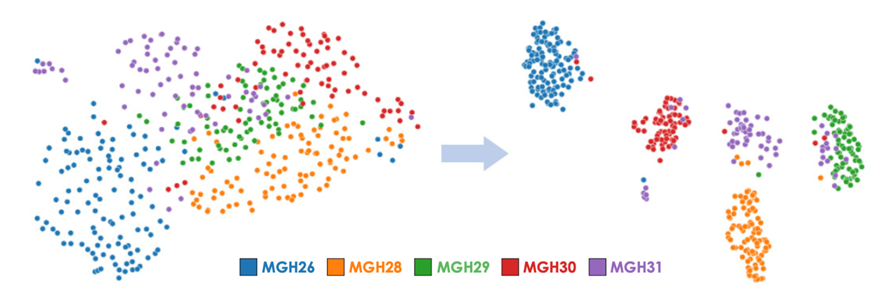

<!--  -->

## Basic Description

This repo contains an implementation of PHet (**P**reserving **Het**erogeneity).

## Citing

If you find *PHet* useful in your research, please consider citing the following paper:

- [XXX].

## Contact

For any inquiries, please contact: [ar.basher@childrens.harvard.edu](mailto:ar.basher@childrens.harvard.edu)